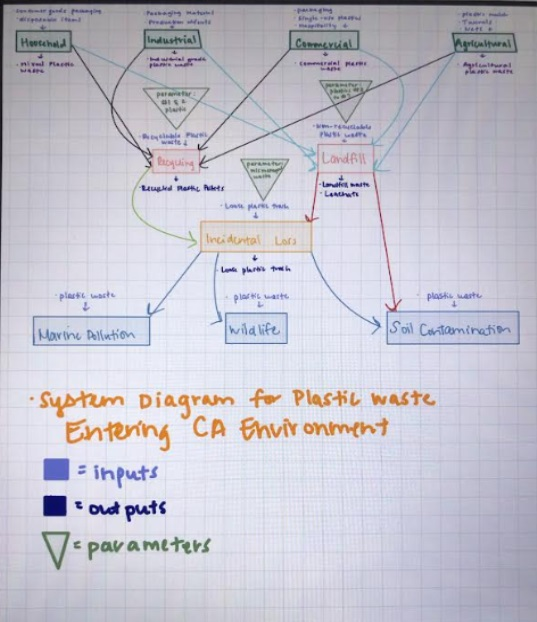

```{r setup, include=FALSE}
knitr::opts_chunk$set(echo = TRUE)
usethis::create_github_token()
```

For our program, we examined the process of plastic waste from source to end-of-life.

Our first category was sources of plastic waste: household, industrial, commercial and agricultural. We then ran that through two parameters: plastic types #1 and #2 that are recyclable will go to the recycling facility, whereas types #3-#8 will be sent to the landfill. The third "box" which plastic waste might end up in is incidental loss, or mismanaged waste. An estimated 22% of all plastic (types #1-#8) will end up as incidental loss worldwide (OECD, 2022). This refers to litter or other plastic that ends up in the environment. Common ways this can happen are: plastic waste blowing out of trash/recycling trucks during pickup/drop off, purposeful or accidental littering by citizens, waste that has fallen off or been purposefully dumped in the ocean by ships, and agricultural plastic (e.g., sheet plastic used to keep moisture in the soil while preventing weed growth, which often degrades into the soil).

Plastic waste coming from agriculture will either be sent to the landfill or end up as incidental loss (the graphic showing that it may go to recycling is incorrect). Plastic that has gone to the recycling plant will, in theory, end up in the form of new products, while plastic waste sent to landfill will theoretically stay in the landfill. Any plastic waste that has been classified as incidental loss will likely end up in the environment, causing harm to marine life, wildlife, and soil.

```{r}

```

References:

OECD - Organization for Economic Cooperation and Development. (2022, February 22). Plastic pollution is growing relentlessly as waste management and recycling fall short, says OECD. OECD. Retrieved March 4, 2024, from <https://www.oecd.org/environment/plastic-pollution-is-growing-relentlessly-as-waste-management-and-recycling-fall-short.htm>
